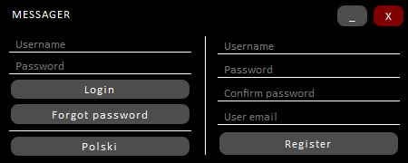

# Client
A desktop client app that allows chatting with other users.

The aplication contains of a login screen, main screen and login screen. Application have hardcoded server addres making it avaible only to use with one service host only.

### Login screen
In the loging screen user can login, use the forgot password feature, change language and register a new account.
Avaible languages are polish and english.

### Main screen
In the main window user can logout from an accound and go into the settings, by default the chat is replaced by welcoming message, after searching and clicking on specified user on list on the left the chat is replaced with current history with this user and messages can be send. Maximum length of message is 250 characters. 

### Settings screen
In the settings user can change defined language, change password or email address and remove their account. 

